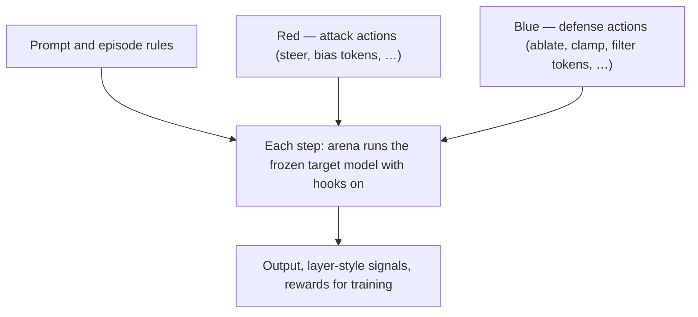
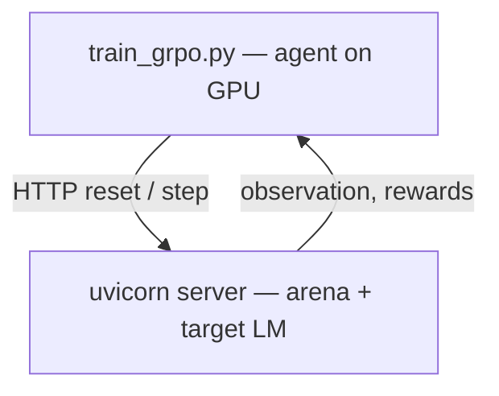

# SIEGE — Interpretability Arena

**Train Red and Blue agents where the fight actually happens: inside the forward pass.**

Most safety stacks only see **text** after the model has already thought its way to an answer. SIEGE is different: it is a small **arena** where two agents, **Red** (attack) and **Blue** (defend), take turns nudging or clamping what happens **inside** a language model while it runs—middle layers, attention, final scores before sampling—not just the prompt string at the top.

You still get a normal prompt in and text out. The twist is that **who wins is decided by hooks on the internal run**, and the agents learn (or follow rules) for **which layer** and **which kind of move** to use.

---

## What we actually do (in plain words)

1. **A frozen target model** runs in the arena server. It answers a task prompt (things like “don’t leak this placeholder secret” or “don’t say this banned phrase”). It is the **playing field**.

2. **Red** tries to push the model toward a **forbidden outcome** (for example, wording that matches a target the episode marks as bad) using **internal moves**: steer activations, bias certain tokens, and similar actions defined in the environment.

3. **Blue** tries to **stop that** without breaking normal helpful behavior—using moves like removing a suspected “attack direction” from activations, dampening a suspicious attention head, or blocking specific tokens at the end.

4. The environment shows both sides **signals** from the run (for example how strong activations look layer by layer). Neither side is told the magic layer by hand; in the learned setup, the **agent model** figures out good actions from **reward** after seeing those signals.

5. **Two ways to run it:** quick **heuristic** Red/Blue (fixed if-this-then-that policies) for debugging, or **GRPO training** where a small agent LLM learns to output structured JSON actions by trial and error against the live arena.



**GRPO training** (when you use `train_grpo.py`) looks like this: a **separate training process** loads the agent on GPU, samples prompts from the arena over HTTP, and updates the agent from rewards. The target model stays in the server; the learner never replaces it mid-episode.



---

## What you can run today

| Mode | Script | What it does | Typical hardware |
|------|--------|----------------|------------------|
| **Heuristic self-play** | `scripts/train.py` | Red/Blue use fixed rules; Hydra + optional WandB; good for env debugging | CPU or single GPU |
| **GRPO (learned agents)** | `scripts/train_grpo.py` | Small **agent** LLM (4-bit LoRA via Unsloth) is trained with **TRL GRPO**; episodes come from `data/episodes.jsonl`; **arena runs as a separate HTTP server** hosting the frozen **target** model | **NVIDIA CUDA** strongly recommended |

The frozen **target** model in the arena is a real small LM (default `Qwen/Qwen2.5-0.5B-Instruct`). The trainable **agent** defaults to `Qwen/Qwen2.5-1.5B-Instruct` with LoRA.

**Current GRPO limitation (honest):** during GRPO, the *other* side’s actions are still produced by **heuristics**, not by loading the previous generation’s saved adapter. Best checkpoints are still written and can be uploaded to the Hub; co-evolution against last-gen adapters is the natural next step.

---

## Why bother with “inside” at all?

If you only read the final answer, you only see the **last step**. The model may already have settled on a harmful or leaky wording many layers earlier. SIEGE is a place to experiment with **catching and countering that earlier**: Blue gets a chance to react while the computation is still unfolding, and Red gets a controlled setting to study **how internal nudges show up in behavior**. It is research infrastructure, not a production safety product—but the story it tells is “oversight might need to live beside the weights, not only above the chat box.”

---

## Repository layout

```
siege/
├── interp_arena/          # Env, hooks, LM wrapper, agents, training config
├── server/                # FastAPI app — serves the arena (target model + hooks)
├── scripts/
│   ├── train.py           # Heuristic loop (Hydra)
│   └── train_grpo.py      # GRPO training (Unsloth + TRL) — talks to server over HTTP
├── data/episodes.jsonl    # Synthetic episode specs for GRPO tasks
├── configs/               # default.yaml, gpu.yaml (Hydra / reference)
└── pyproject.toml
```

---

## Quick start

### 1. Install

```bash
cd siege
uv venv && source .venv/bin/activate   # or your preferred venv
uv pip install -e ".[dev]"
```

**GRPO additionally needs the `gpu` extra** (includes **OpenEnv** (`openenv-core`), **Unsloth**, and TRL/PEFT; CUDA at runtime). The base install already pulls `openenv-core` for the FastAPI server; the `gpu` extra lists it again so the GRPO/RL profile is explicit.

```bash
uv sync --extra gpu
# or, with dev tools:  uv sync --extra dev --extra gpu
```

**Python 3.10–3.13 for GRPO:** **Unsloth** patches TRL at import; on **Python 3.14+** the generated `UnslothGRPOTrainer` can fail with `SyntaxError` (e.g. bad line in `unsloth_compiled_cache/`). The package metadata requires **`<3.14`**. The repo includes **`.python-version`** (`3.12`) so **`uv`** can pick 3.12 for new venvs. If the environment still used **3.14**, run `uv python install 3.12`, `rm -rf .venv unsloth_compiled_cache /tmp/unsloth_compiled_cache`, `uv venv` (reads `.python-version`), `uv sync --extra gpu`. After switching Python, stale caches cause the same error — **`load_agent_model` clears them and retries the import once**; if you still see compile errors, delete those two directories by hand and run again.

If you use plain `pip` instead: `pip install -e ".[gpu]"` (pulls `openenv-core`, `unsloth`, TRL, PEFT, bitsandbytes).

`python-dotenv` is a direct dependency: `scripts/train_grpo.py` loads `.env` automatically.

**TRL / mergekit:** `train_grpo` uses **TRL 0.26.x**. If you ever **`pip install mergekit`**, TRL will detect it and import it from `merge_model_callback`; **mergekit 0.1.4** then often crashes at import on **Pydantic 2.11+** (`torch.Tensor` schema errors). **GRPO does not need mergekit** — run **`uv pip uninstall mergekit`** (or `pip uninstall mergekit`) before training. The training script fails fast with a clear message if `mergekit` is present (override: `SIEGE_ALLOW_MERGEKIT=1`, rarely useful).

**Arena server / `BertForPreTraining`:** If `reset` over OpenEnv fails with *Could not import module 'BertForPreTraining'*, the **server** is usually a **different Python** than the one from **`uv run`**, or an **old `uvicorn` is still bound to the port** after you `git pull` / `uv sync` (so `/health` works but the process never imported the fixed stack). The repo pins **`transformers==4.56.2`** and **`transformer-lens==3.0.0`**. As of a recent `server/app.py` change, the arena should **refuse to start** (exit on import) if `import transformer_lens` fails in that process. **Start the arena with `uv run uvicorn …`** (see step 3), then verify with **`uv run python -c "import sys; import transformer_lens; print(sys.executable)"`**. If the error persists, find what owns the port: **`lsof -i :8000`** or **`ss -lntp`**, kill the old PID, and start again. Reinstall: **`uv sync`** or **`pip install -r server/requirements.txt --force-reinstall`** in that same environment.

### 2. Configure secrets and logging (optional)

Copy and edit `.env` (see `.env.example`):

```bash
cp .env.example .env
```

Common variables:

- **`WANDB_API_KEY`** — online logging (also accepted: `SIEGE_WANDB_API_KEY`, normalized at runtime).
- **`WANDB_PROJECT`** — defaults to `interp-arena` if unset in config.
- **`HF_TOKEN`** — Hugging Face upload for best/latest adapters (alias: `HUGGINGFACE_TOKEN` or `SIEGE_HF_TOKEN`).
- **`SIEGE_HF_REPO_ID`** — Hub repo for uploads (default in code: `BART-ender/siege`; override with your namespace).

You can also `export` these in the shell before running; `.env` is for convenience.

### 3. Start the arena server (terminal 1)

The GRPO script expects `/health`, `/reset`, and `/step` on **`SIEGE_ENV_URL`** (default `http://localhost:8000`).

```bash
uv run uvicorn server.app:app --host 0.0.0.0 --port 8000
```

Use the same venv as training (`uv run`); a global `uvicorn` often misses the repo pins and breaks transformer-lens on the first `reset`. Equivalent: `uv run server` (see `[project.scripts]` in `pyproject.toml`).

### 4. Run training (terminal 2)

Heuristic self-play:

```bash
python scripts/train.py
```

GRPO (GPU):

```bash
python scripts/train_grpo.py
```

Artifacts default to **`./outputs/grpo`** (override with `SIEGE_OUTPUT_DIR`). Training also writes `training_summary.json` and eval JSON per run.

### 5. Tune without editing code

All major GRPO knobs are environment variables (see `interp_arena/training/config.py`), for example:

- `SIEGE_AGENT_MODEL_ID`, `SIEGE_TARGET_MODEL_ID`, `SIEGE_ENV_URL`
- `SIEGE_NUM_GENERATIONS`, `SIEGE_STEPS_PER_AGENT`
- `SIEGE_GRPO_*` (batch size, LR, generations, sequence lengths, …)
- `SIEGE_REPORT_TO` — passed to TRL (`wandb` by default; set `none` to disable if you prefer)

---

## Hugging Face Spaces (Docker)

The repo includes a **root `Dockerfile`** (port `7860`, `PORT`-aware) and `deploy/huggingface/DEPLOY.md` with step-by-step instructions. Copy `deploy/huggingface/README.md` to your Space’s **root** `README.md` for the Space card metadata (`sdk: docker`, `app_port: 7860`) or merge the YAML block into an existing card.

---

## Benchmark tasks

Episodes are **synthetic** (placeholder secrets, banned tokens, toy “config leaks”) defined in `data/episodes.jsonl`—suitable for sharing and for learning the stack without real credentials.

---

## References

- [TransformerLens](https://github.com/neelnanda-io/TransformerLens)
- [Representation Engineering](https://arxiv.org/abs/2310.01405) — Zou et al., 2023
- [Activation Steering](https://arxiv.org/abs/2308.10248) — Turner et al., 2023
- [GCG Adversarial Suffixes](https://arxiv.org/abs/2307.15043) — Zou et al., 2023
