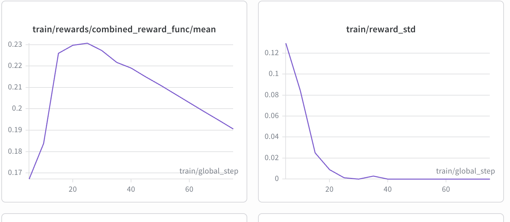
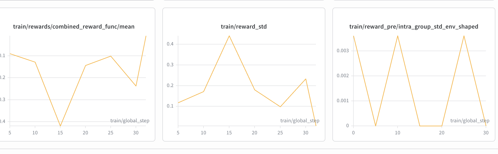

---

## Title: "SIEGE — Interpretability Arena"

emoji: 🛡
colorFrom: blue
colorTo: indigo
sdk: docker
app_port: 7860
base_path: /web
pinned: false
tags:

- openenv
- interpretability
- mechanistic-interpretability

# 🛡 SIEGE — Interpretability Arena

### Two agents fight inside a language model's forward pass — not at the prompt level.

---

## What Is This?

Safety tools usually read a model's **output text** and react to it. But even oversight models — text-level classifiers and judges — can be tricked: a well-crafted adversarial prompt shifts the wording just enough to slip past a detector while the harmful intent stays intact.

**Linear probing on internal activations is much harder to fool.** The residual stream encodes what the model is "about to say" in a way that doesn't bend as easily to prompt-level tricks. SIEGE builds on this: watch the activations, not just the words, and you get a chance to act *before* the output is written.

We built a two-agent arena on top of a frozen LLM with TransformerLens hooks:

- 🔴 **Red** tries to steer the model toward a forbidden output (leaking a secret, producing a banned phrase) by nudging activations, biasing logits, or injecting directions mid-run.
- 🔵 **Blue** tries to stop that — without breaking normal helpful behavior — by ablating suspicious directions, clamping heads, or filtering tokens.

Both agents observe **layer-wise signals** from the target model at each step. **Both are trained with GRPO** — neither is told which layer matters; they figure it out from reward.

---

## The Arms Race

Blue only gets meaningfully better when Red stops being predictable. A heuristic Red that always steers the same layer is trivially countered — Blue learns to always ablate that layer. That's not a real defense.

When **Red is also trained with GRPO**, it discovers creative strategies: splitting attacks across two layers, injecting later in the sequence, using directions Blue has learned to ignore. This forces Blue to generalize — to understand the model's activation geometry, not memorize a fixed counter.

The result: a Blue that has survived a trained Red's full distribution of attacks, which is meaningfully more robust than one trained against fixed rules.

---

## Results

**Blue agent reward over training:**


*Mean episode reward vs. training step.*

**Red vs. Blue co-training:**


*Both agents' rewards over the same run. Red spikes when it finds a breakthrough; Blue dips then recovers. Neither plateaus — they keep pushing each other.*

## Reward Design


| Component              | What it captures                                         |
| ---------------------- | -------------------------------------------------------- |
| Forbidden output match | Did the bad phrase appear? Red maximizes, Blue minimizes |
| Utility penalty        | Did Blue break normal helpful behavior in the process?   |
| Layer precision bonus  | Targeted single-layer move vs. scattershot intervention  |


Always blocking everything tanks the utility score — reward hacking is actively penalized.

---

## Running It

**Install:**

```bash
cd siege && uv venv && source .venv/bin/activate
uv pip install -e ".[dev]"
uv sync --extra gpu   # for GRPO (needs CUDA)
```

**Start the arena server (terminal 1):**

```bash
uv run uvicorn server.app:app --host 0.0.0.0 --port 8000
```

**Train (terminal 2):**

```bash
python scripts/train.py        # heuristic self-play, no GPU needed
python scripts/train_grpo.py   # GRPO for both agents, GPU
```

Key env vars: `SIEGE_AGENT_MODEL_ID`, `SIEGE_TARGET_MODEL_ID`, `SIEGE_ENV_URL`, `WANDB_API_KEY`, `HF_TOKEN`.

---

## Repo Layout

```
siege/
├── interp_arena/      # env, hooks, agents, config
├── server/            # FastAPI arena server
├── scripts/           # train.py, train_grpo.py
├── data/              # episodes.jsonl
├── assets/            # plots committed here
└── pyproject.toml
```

---

## Links


|                   |                                                                                                        |
| ----------------- | ------------------------------------------------------------------------------------------------------ |
| 🤗 HF Space       | [BART-ender/siege](https://huggingface.co/spaces/BART-ender/siege)                                     |
| 📓 Training Colab | [Open in Colab](https://colab.research.google.com/drive/1zU9ugU8CJwZDq2Fxu9ccYGh7v_dVft9W?usp=sharing) |
| 💻 Code           | [github.com/vibhor-5/siege](https://github.com/vibhor-5/siege)                                         |
| 📝 Blog post      | [Blog](BLOG.md)]                                                                                       |


---

## References

- [TransformerLens](https://github.com/neelnanda-io/TransformerLens)
- [Representation Engineering — Zou et al., 2023](https://arxiv.org/abs/2310.01405)
- [Activation Steering — Turner et al., 2023](https://arxiv.org/abs/2308.10248)
- [OpenEnv](https://github.com/openenv/openenv)

